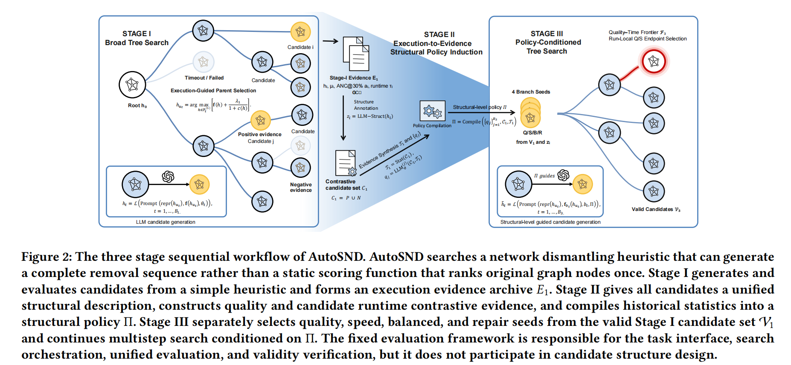

## Why it matters

Most LLM-AHD systems rely on a single objective signal, which mixes "did this program get a good score?" with "why did this program get a good score?". Network dismantling programs in particular are bundles of interdependent signals (residual degree, local access, state updates) whose effectiveness depends on how they interact, not just on the final ranking. Treating only the final score leaves the search blind to the structure of the program, so similar-looking candidates are collapsed together and informative failures are discarded. AutoSND argues that execution evidence — quality, runtime, and execution-state traces — should be compiled into explicit structural policies that guide further search.

## Core method

AutoSND is a three-stage tree-search framework for automated network dismantling heuristic discovery:

- **Stage I (exploration)** starts from simple heuristics and records candidate quality, runtime, and execution states for each program.
- **Stage II (policy compilation)** turns those records into structured descriptions and contrasts positive and negative examples to compile explicit policies about signal reuse, local access, and state-update boundaries.
- **Stage III (policy-conditioned refinement)** conditions further tree search on those policies and selects quality- and speed-prioritized candidates from a quality/runtime Pareto frontier.

The discovered programs use residual degree as a backbone, bounded local signals to adjust node order, and restricted state updates. On real and large networks, AutoSND reports competitive dismantling quality, high candidate validity, and improved runtime, while the execution-to-policy loop makes the final program structure more interpretable than scalar ranking or free-form reflection alone.

## Contributions

- Treats execution evidence (quality, runtime, execution states) as a first-class search artifact for heuristic discovery.
- Compiles positive/negative contrasts into explicit structural policies over signal reuse, local access, and update boundaries.
- Policy-conditioned tree search with Pareto-based quality/runtime candidate selection.
- Interpretable dismantling programs and strong validity / runtime properties on real and large networks.

## Strengths and limitations

AutoSND turns "what worked" into "what structure to try next", producing more interpretable programs and avoiding redundant search around similar candidates. Its benefit depends on having meaningful execution traces, on the contrast set being rich enough to surface non-trivial policies, and on the dismantling problem admitting interpretable structural priors. Policy compilation also adds an extra stage before candidate generation, and the approach is currently focused on network dismantling rather than the wider combinatorial landscape.

## What to improve

Generalizing structural-policy compilation to richer problem classes, learning or pruning the policy set online, and integrating the evidence archive with planner-style reuse across related dismantling tasks.

## Connections

AutoSND extends evolutionary and tree-search-based heuristic discovery (EoH, MCTS-AHD) by feeding execution evidence back into search. It is complementary to reflective and memory-based critics (ReEvo, CALM, MEVO) and to full-algorithm synthesis systems (A2DEPT, ATLAS) by targeting the structural content of a single algorithm family rather than its overall scaffold.