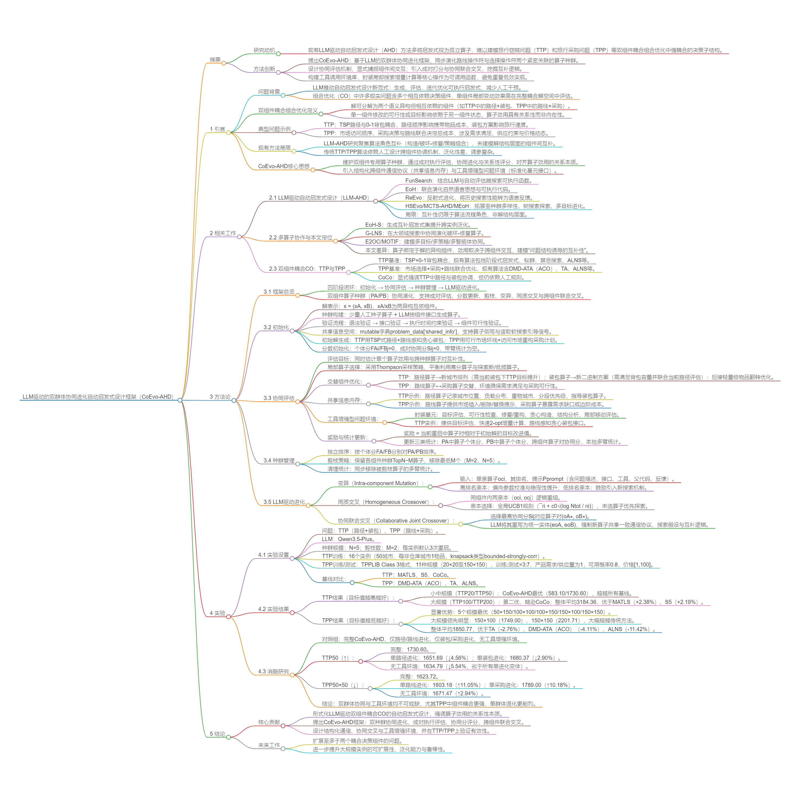

## Why it matters

Most LLM-driven automated heuristic design systems evolve heuristics as isolated algorithmic units, which fails to model strong coupling among multiple decision substructures in problems like TTP and TPP. CoEvo shifts the design objective: instead of optimizing individual heuristics in isolation, it co-evolves paired component operators and evaluates their effectiveness jointly under the full coupled objective.

*Paper cover and opening figure. Source: Kuang et al., CoEvo; see the [arXiv paper](https://arxiv.org/abs/2606.00718).*

## Core method

The paper proposes CoEvo, a dual-population co-evolutionary framework with component-specific operator populations. It adopts cooperative evaluation to compute both individual operator scores and pairwise synergy scores, and evolves new operators through intra-component mutation, homogeneous crossover, and cross-component joint crossover.

A tool-augmented environment and structured inter-component communication are further introduced to improve operator reliability and coordination.

Experiments are conducted on TTP and TPP benchmarks.

## Contributions

- Formalization of bi-component coupled automated heuristic design with relational operator utility.
- Dual-population co-evolution with paired evaluation, synergy scoring and cross-component joint crossover.
- Structured inter-component communication protocol and tool-augmented problem environment.

## Strengths and limitations

It automatically discovers complementary operator pairs and delivers competitive solution quality against traditional heuristics, with particularly pronounced advantages on large-scale TPP instances.

However, it introduces cross-component credit assignment complexity, and its search depth on large TTP still lags behind top handcrafted methods.

## What to improve

Future work can extend the framework to problems with more than two coupled decision components, improve search depth and robustness on large-scale instances, add cost-aware population size control, and explore behavioral diversity metrics for component-level synergy.

## Connections

CoEvo builds upon the lineage of EoH and EoH-S. Unlike multi-operator collaboration at the algorithmic workflow level, it ties operators to heterogeneous decision components of the problem itself, modeling operator complementarity from the problem-structure level.
