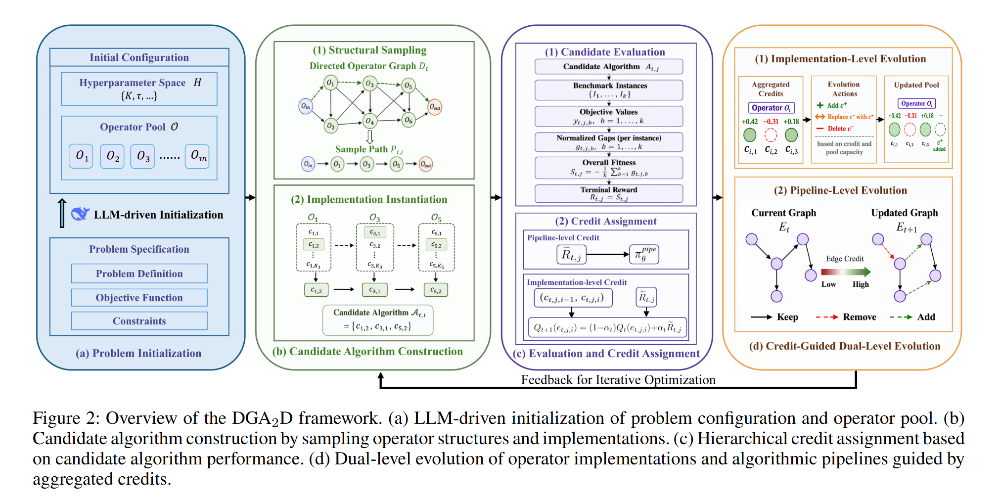

## Why it matters

Most LLM-AHD systems evolve an isolated function inside a fixed solver scaffold, or evolve a single heuristic inside a search loop. Both routes limit the search to local algorithmic decisions: the rest of the algorithm — how operators are sequenced, which implementation variants are used, which components exist at all — is decided by the user. DGA2D argues that automated design should be free to change those decisions as well, and represents the open algorithm space as a graph that the LLM can simultaneously edit, extend, and traverse.

## Core method

DGA2D structures the open algorithm space as a directed graph:

- **Nodes** are functional operators with multiple candidate implementations.
- **Edges** encode execution order between operators.
- **Directed walks** over this graph form complete algorithmic pipelines.

The LLM edits operator code, rearranges connections, and chooses implementation variants. Bounded walks keep candidate pipelines tractable, and the framework combines pipeline-level rewards with **first-order path-dependent credit assignment** for implementation transitions. Low-credit implementations and edges are removed or replaced, while the LLM proposes new alternatives.

Across twelve combinatorial optimization problems (including flexible job-shop scheduling, TSP, maximum independent set, and three-dimensional container loading), DGA2D reports lower normalized gaps than several LLM-driven AHD baselines, illustrating a route from fixed solver templates toward system-level algorithm synthesis.

## Contributions

- A directed-graph representation that exposes both functional operators and their implementation choices to LLM-driven search.
- Bounded graph walks as the search object, balancing expressiveness with tractable candidate generation.
- First-order path-dependent credit assignment for transitions between implementation variants.
- Cross-domain evidence on twelve combinatorial optimization problems.

## Strengths and limitations

DGA2D gives the LLM genuine control over algorithm structure rather than only over isolated functions, and the path-dependent credit signal provides a finer-grained learning signal than endpoint rewards alone. The graph and the credit assignment introduce additional hyperparameters (walk bounds, transition depth, removal thresholds) and depend on a sufficiently rich initial operator library; without it, the search can converge to thin variants of a fixed pipeline.

## What to improve

Automated operator-library construction, principled walk-depth and budget schedules, and integration with continuous- or hyperparameter-level tuning inside each operator.

## Connections

DGA2D contrasts with A2DEPT on the broader program-synthesis line: both pursue system-level algorithm design, but DGA2D uses directed operator graphs and path-dependent credit while A2DEPT uses program trees. It also complements design-object expansions of EoH (BEAM, MEVO) by treating the algorithm itself, rather than the heuristic set, as the evolving artifact.