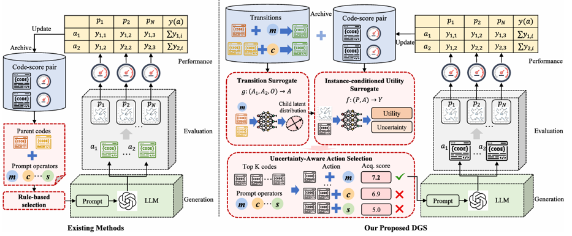

## Why it matters

In the common black-box query setting, each LLM query and evaluator call is expensive and returns only generated code and a score. Before spending this budget, the system must choose which archived heuristics to reuse as parents and which generation operator should transform them. Existing methods make this choice with predefined rules—archive ranking, stochastic parent selection, tree policies, or fixed operator schedules—which provide only indirect evidence for which concrete operator-parent action should receive the next query.

## Core method

Dual-Surrogate Guided Search (DGS) keeps the EoH-style prompt-operator set fixed and instead learns which operator-parent action to apply. It trains two surrogates from the archive:

- A **transition surrogate** predicts the latent distribution of the child representation induced by an operator-parent action.
- An **instance-conditioned utility surrogate** estimates the expected performance of sampled child latents.

An **uncertainty-aware acquisition rule** combines predicted utility, utility uncertainty, and transition uncertainty to select the next action before invoking the LLM. A shared latent representation (a ModernBERT code encoder) maps heuristic code, problem instances, and operators into a learned continuous space, and the surrogates are updated with a mix of periodic full updates and fast intermediate updates to control online cost.

## Contributions

- Formulates pre-generation operator-parent selection as a learned action-selection problem for guiding LLM code generation in AHD.
- Introduces the dual-surrogate module and an uncertainty-aware acquisition rule that allocates expensive LLM and evaluator calls.
- Provides empirical comparisons, ablation studies, and action-selection analyses across a diverse heuristic-design suite, showing behavior beyond simple archive ranking or fixed operator preferences.

## Strengths and limitations

DGS is sample-efficient, compatible with other operator sets, and demonstrably improves guidance over fixed rules. Its costs are the surrogate overhead on large archives and reliance on historical pre-generation records, and it is evaluated on a defined heuristic-design suite rather than all domains.

## What to improve

The paper points to extending DGS to broader heuristic-design problem families, integrating dynamic archive management, and exploring richer uncertainty representations and alternative acquisition strategies.

## Connections

DGS is orthogonal to search-backbone changes: it operates on top of the archive–generation–evaluation loop shared by FunSearch, EoH, ReEvo, and MCTS-AHD, and learns action-level guidance from the same code-score and parent-child transition records those methods already produce.
