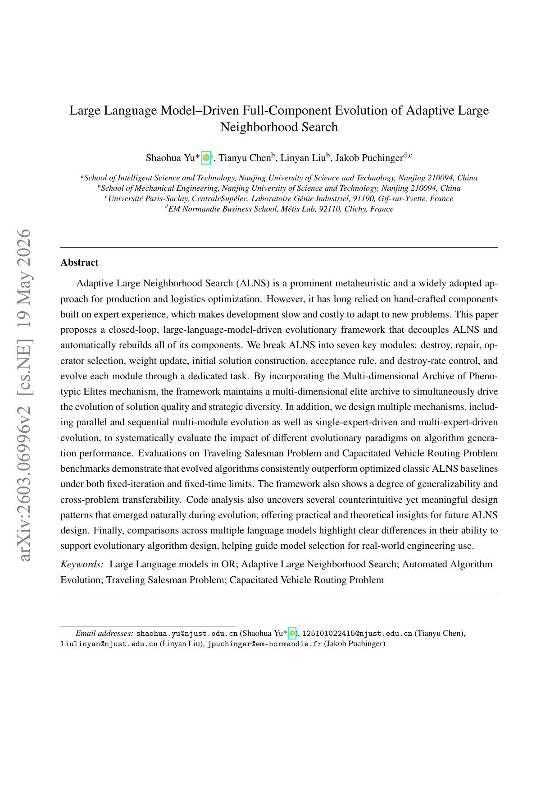

## Why it matters

ALNS performance depends on operators, adaptive scheduling, and control logic that are usually hand-crafted and hard to retune for new problem landscapes. Prior LLM-AHD work often evolves local destroy or repair heuristics while leaving higher-level ALNS decision and control layers fixed. That unbalanced design can bottleneck even strong operators.

*Paper cover and opening figure. Source: Yu et al., Evolved-ALNS; see the [arXiv paper](https://arxiv.org/abs/2603.06996).*

## Core method

The paper treats ALNS as seven interacting modules: initial-solution construction, destroy operators, repair operators, operator selection, weight update, acceptance criterion, and destruction-degree control. Each module is evolved in a closed generate-evaluate-feedback loop driven by an LLM. MAP-Elites preserves quality and behavioral diversity, while isolated and cascade evaluators score candidates under controlled budgets.

The framework is instantiated along parallel versus serial component scheduling and single-expert versus multi-expert prompt orchestration. The best module elites are assembled into complete Evolved-ALNS algorithms for TSP and CVRP evaluation on TSPLIB and CVRPLIB under fixed-iteration, fixed-time, and extended-budget regimes.

## Contributions

- A full-component LLM evolution pipeline for ALNS rather than operator-only redesign.
- MAP-Elites plus cascade evaluation to search complete metaheuristic designs.
- Systematic comparison of evolution paradigms, LLM backends, and cross-problem transfer between TSP and CVRP.

## Strengths and limitations

The work shows that evolved ALNS can beat carefully tuned Baseline-ALNS and surfaces interpretable design patterns such as scale-normalized acceptance and structure-aware operators. Component-level performance does not always compose into the best full algorithm, transfer is asymmetric across problems, and offline evolution remains expensive.

## What to improve

Joint co-evolution of interacting modules, cheaper module evaluators, and published reusable Evolved-ALNS libraries would make the full-pipeline search easier to reproduce and deploy.

## Connections

Evolved-ALNS extends LLM-AHD from heuristic functions or operators to a complete metaheuristic stack, making the design object an entire ALNS implementation rather than a single local search component. The atlas records this as a generalization of EoH along the design-object dimension.
