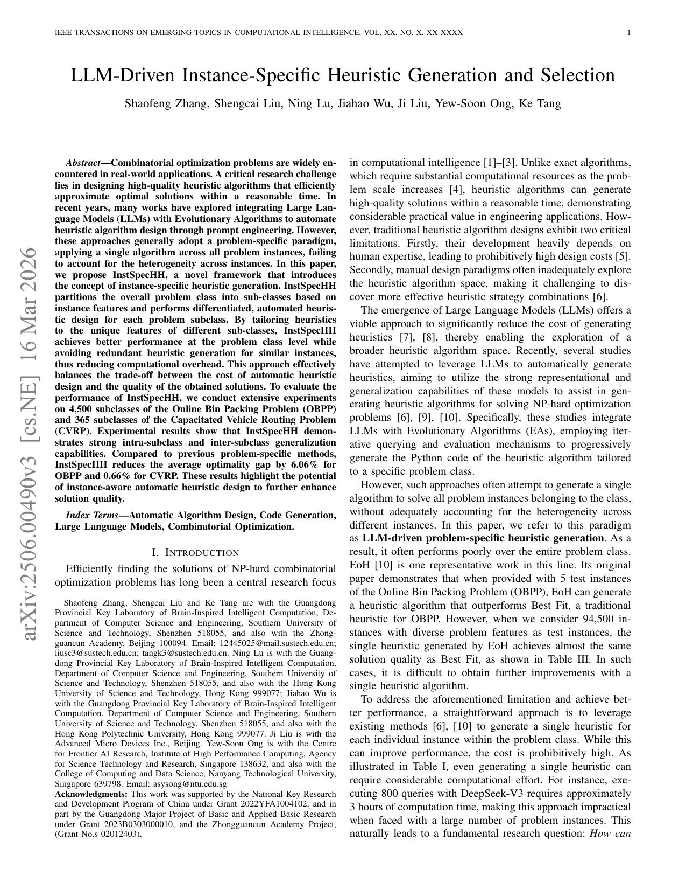

## Why it matters

LLM-driven automatic heuristic design often returns one heuristic for an entire problem class. That problem-specific paradigm can miss instance heterogeneity: a heuristic strong on a few training instances may collapse toward handcrafted baselines once the test distribution spans many feature regimes. Designing a fresh heuristic for every instance is also prohibitively expensive under realistic LLM query budgets.

*Paper cover and opening figure. Source: Zhang et al., InstSpecHH; see the [arXiv paper](https://arxiv.org/abs/2506.00490).*

## Core method

InstSpecHH assumes that instances with similar features can share one heuristic. Offline, it partitions the instance space into subclasses from discrete problem features, builds feature and natural-language representations for each subclass, and pairs an evolutionary loop with an LLM to generate a subclass-specific executable heuristic. Online, given a new instance, an LLM selects the most appropriate stored heuristic instead of regenerating code from scratch. Offline construction cost is amortized as more inference instances arrive.

The paper instantiates the framework on Online Bin Packing and Capacitated Vehicle Routing, reporting intra-subclass and inter-subclass generalization and lower average optimality gaps than prior problem-specific LLM-AHD baselines.

## Contributions

- Diagnoses the limitation of single-heuristic, problem-class-wide LLM-AHD under heterogeneous instances.
- Proposes InstSpecHH, an LLM-driven pipeline that couples subclass construction, subclass-specific heuristic generation, and online heuristic selection.
- Evaluates the approach over thousands of OBPP and hundreds of CVRP subclasses with explicit generalization and cost-amortization analysis.

## Strengths and limitations

Subclassing turns instance awareness into a reusable heuristic library rather than a one-shot generator or a tiny fixed portfolio. Selection quality depends on the chosen features and on the LLM's ability to match instances to subclasses. Offline generation remains costly, and the paper notes that code and data will be released publicly rather than shipping a repository link at submission time.

## What to improve

Richer or learned instance representations, cheaper subclass-level search budgets, and a published selector-plus-heuristic library would make the online phase easier to reproduce and extend beyond hand-specified feature grids.

## Connections

InstSpecHH sits downstream of problem-specific evolutionary LLM-AHD lines such as EoH: it keeps LLM-based heuristic generation, but changes the operating scope from one class-wide winner to instance-aware subclass generation and selection. 
