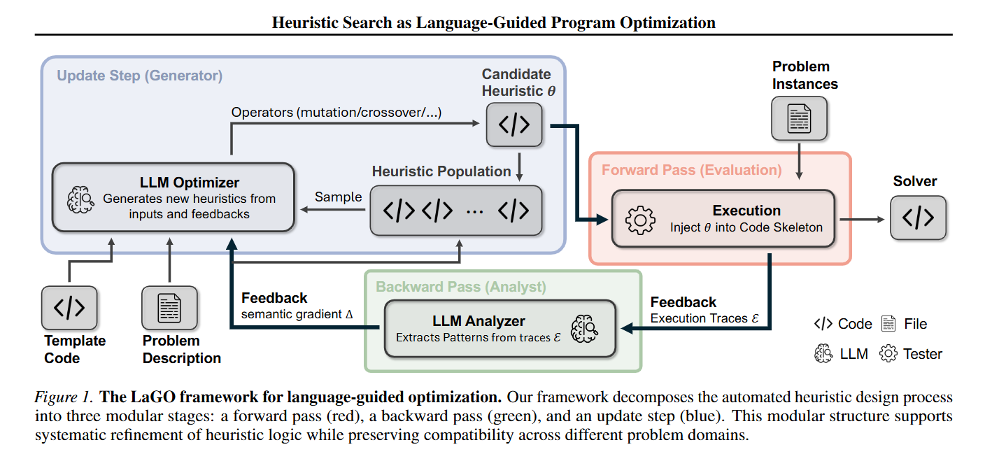

## Why it matters

Most LLM-AHD systems evolve heuristic functions inside a fixed scaffold and conflate evaluation, critique, and code generation into a single loop. That is convenient but makes it difficult to swap in richer critics, alternative update rules, or role-specific executors without rewriting the whole pipeline. LaGO argues that what looks like a single "LLM + evaluator + reflector" cycle is actually a modular program-optimization process that can be partially reused, partially replaced, and partially compared.

## Core method

LaGO separates the search into three explicit roles:

- A **forward pass** runs candidate programs and records trajectories, costs, validity, and intermediate states.
- A **backward pass** maps those records into a semantic gradient, which can be a natural-language critique, structured feature statistics, an executable analyst, or a hybrid of them.
- An **update step** uses the gradient to propose new programs, and supports both constructive and refinement heuristics, soft penalty shaping, and code-writing analysts that perform lightweight numerical experiments.

This view lets the authors treat several existing AHD pipelines as restricted instances of LaGO with frozen roles. The framework also introduces diversity-aware population management and is evaluated across four real combinatorial optimization domains (pickup and delivery, crew pairing, technology mapping, intraoperative optimization) where LaGO improves the quality-yield trade-off over strong baselines.

## Contributions

- A unified forward / backward / update view of LLM-driven heuristic search.
- Explicit support for executable semantic feedback, constructive and refinement updates, and diversity-aware population control.
- Empirical evidence across four real combinatorial optimization domains.

## Strengths and limitations

The decomposition clarifies which role a new component is replacing, supports pluggable critics and updaters, and turns prior systems into comparable instantiations. The framework inherits the brittleness of LLM-driven code generation, depends on having a meaningful semantic representation for each problem, and does not by itself guarantee correctness or feasibility when the analyst is allowed to run executable code.

## What to improve

Stronger type or contract constraints between forward and update artifacts, learned critics that share knowledge across problem domains, and an explicit treatment of feasibility and safety when the backward pass can run code.

## Connections

LaGO generalizes EoH-style heuristic evolution into a modular program-optimization framework. Its forward / backward / update split also subsumes reflective loops such as ReEvo and connects naturally to multi-agent or memory-augmented critics.