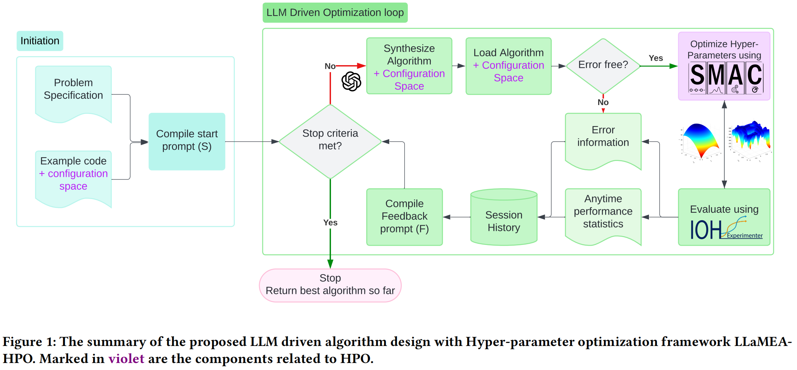

## Why it matters

LLM-based automatic heuristic design can generate useful metaheuristics, but existing evolutionary loops often spend costly LLM calls on both structural code search and numerical hyper-parameter tuning. LLaMEA-HPO addresses this inefficiency by moving hyper-parameter optimization into the loop: each generated algorithm is tuned before its performance is fed back to selection, reducing misleading fitness signals and letting the LLM focus on algorithmic structures and control flows rather than parameter-level search.

## Core method

*Overview of the LLaMEA-HPO loop. Source: van Stein et al., LLaMEA-HPO, Figure 1.*

LLaMEA-HPO starts from the open-source LLaMEA evolutionary code-generation framework. The LLM receives a task prompt and proposes a candidate algorithm, but the prompt is extended so that the LLM also returns a Python dictionary describing the candidate's hyper-parameter configuration space. This keeps the design object as executable algorithm code while exposing the numeric knobs that should be tuned by a separate optimizer.

The added HPO component, implemented with SMAC, evaluates configurations for the generated algorithm and returns the tuned performance to the evolutionary loop. Selection and mutation then operate on candidates whose parameters have already been optimized, so the feedback reflects algorithmic quality more directly than a single default parameter setting. The paper evaluates this loop on online bin packing, BBOB black-box optimization, and traveling salesperson benchmarks.

## Contributions

- A hybrid LLaMEA-HPO framework that integrates LLM-driven algorithm design with SMAC-based hyper-parameter optimization inside the evolutionary loop.
- A prompt and candidate interface in which the LLM outputs both executable algorithm code and a hyper-parameter search space for the HPO stage.
- Empirical evidence that delegating parameter tuning to SMAC can reduce LLM query budget and computational cost while achieving superior or comparable performance on online bin packing, black-box optimization, and TSP benchmarks.
- A clearer separation between algorithmic innovation, structural code search, and parameter tuning for future LLM-driven code optimization systems.

## Strengths and limitations

The clear strength is specialization: SMAC handles hyper-parameter tuning while the LLM focuses on novel algorithmic structures and control flows. The paper reports better convergence and high solution quality with significantly fewer LLM queries, but the method still depends on HPO budget allocation, benchmark coverage, and the quality of the generated search space.

## What to improve

Useful next steps include dynamically adjusting the HPO budget to algorithm complexity, testing more advanced HPO techniques, expanding to more diverse problem domains, and studying larger-population variants such as HPO-integrated EoH or LLaMEA.

## Connections

LLaMEA-HPO extends LLaMEA by adding hyper-parameter optimization inside the evolutionary loop, and it fits the broader LLM-based automatic heuristic design setting represented by EoH. Its main distinction is the separation between algorithmic structure generation by the LLM and numerical parameter tuning by SMAC.
