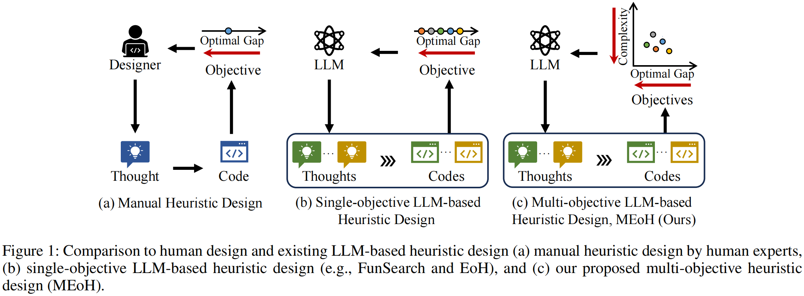
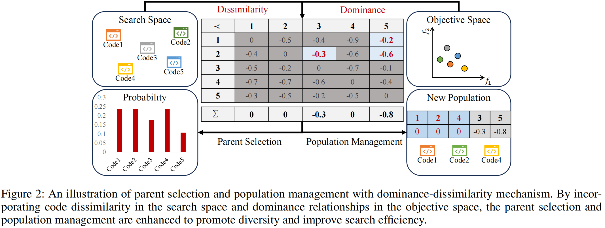

## Why it matters

Existing LLM-based heuristic design methods usually optimize one objective, such as solution quality on the target problem. MEoH addresses the practical need to consider additional criteria such as efficiency and scalability by searching for a set of trade-off heuristics rather than a single best-scoring heuristic.

## Core method

*Comparison of manual, single-objective LLM-based, and multi-objective LLM-based heuristic design. Source: Yao et al., MEoH, Figure 1.*

MEoH treats each heuristic as a language description, executable code, and a vector of objective values. The framework initializes a population of heuristics with an LLM, evaluates them on multiple objectives, and uses search operators adapted from EoH to generate offspring in a zero-shot manner.

*Parent selection and population management with dominance-dissimilarity. Source: Yao et al., MEoH, Figure 2.*

The key mechanism is dominance-dissimilarity. MEoH combines dominance relationships in the objective space with code dissimilarity in the search space, using the resulting score to guide parent selection and population management. This lets the population keep both convergence toward strong objective values and diversity among heuristic implementations.

## Contributions

- A multi-objective formulation of LLM-based automatic heuristic design.
- A dominance-dissimilarity mechanism for parent selection and population management.
- A zero-shot LLM evolutionary search that generates a non-dominated set of heuristics in one run.
- Experiments on online bin packing and TSP showing trade-off heuristics with competitive quality and up to 10x efficiency gains.

## Strengths and limitations

MEoH's main strength is its ability to produce diverse trade-off heuristics over multiple objectives, outperforming FunSearch and EoH on the studied settings. The paper mainly demonstrates two-objective cases, with three-objective results in the appendix, so many-objective performance and broader heuristic design tasks remain open.

## What to improve

Useful next steps include testing MEoH on many-objective cases and applying the framework to a broader range of heuristic design tasks.

## Connections

MEoH extends the EoH framework from single-objective heuristic evolution to multi-objective heuristic search. It keeps the language-and-code heuristic representation but changes selection and population management so the search can return a non-dominated set of heuristics.
