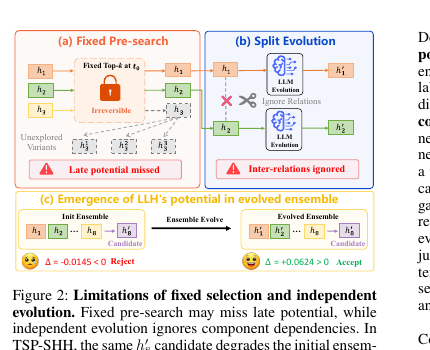
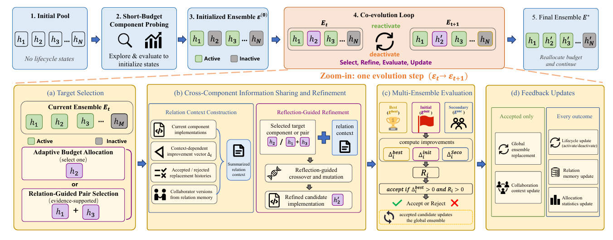
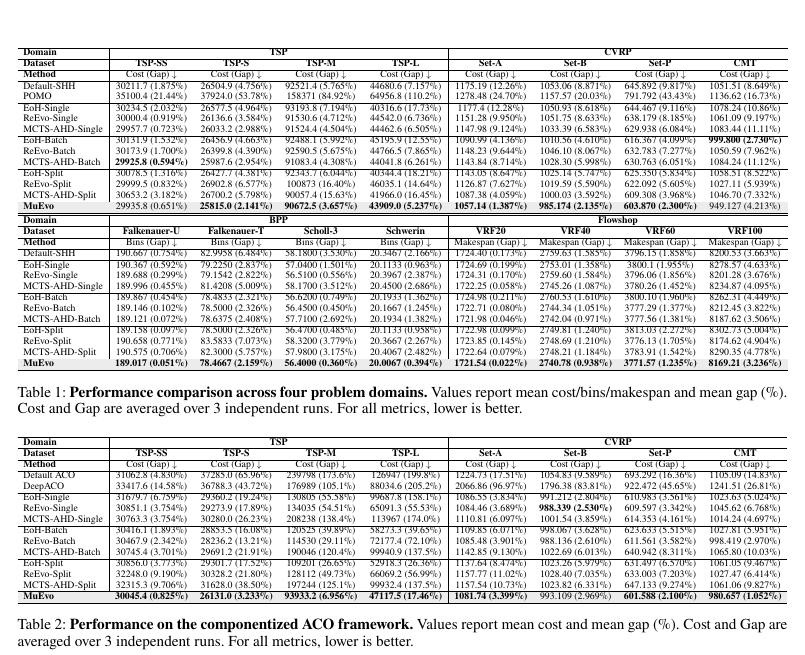
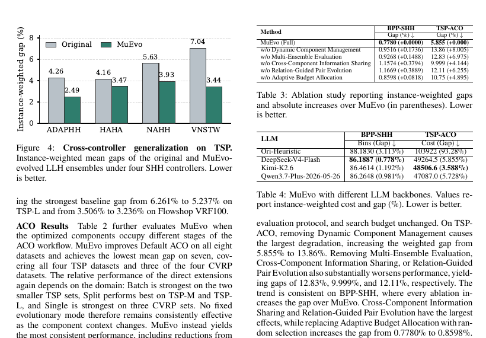

## Why it matters

Most LLM-based automatic heuristic design methods optimize one heuristic at a time. That does not match algorithm frameworks whose behavior comes from several interacting components: a component that looks weak early can become useful later, and independently improved components can still form a weak ensemble.

MuEvo treats the ensemble, rather than an isolated heuristic, as the design object. Its experiments cover both controller-mediated selection hyper-heuristics and functionally differentiated components in ant colony optimization.

*Figure 2. Fixed pre-search can miss late-potential components, while independent evolution ignores inter-component dependencies. Source: Lv et al., “MuEvo,” Figure 2, [arXiv:2608.03636](https://arxiv.org/abs/2608.03636).*

## Core method

MuEvo keeps the reflective LLM-evolution loop used by ReEvo—candidate programs are generated, reflected on, and refined through LLM-guided crossover and mutation—then adds two mechanisms for the multi-component setting:

- **Dynamic Component Management:** every valid component is briefly probed and placed in a reversible active/inactive lifecycle. Later ensemble feedback can reactivate a component that was underestimated during initialization.
- **LLM-Driven Co-Evolution:** component populations are evolved with multi-ensemble evaluation, cross-component information sharing, relation-guided pair evolution, and adaptive budget allocation.

Each candidate component is evaluated in several collaboration contexts, including the current best ensemble and diverse historical ensembles. This makes selection sensitive to context-dependent improvements, synergy, redundancy, and conflict.

*Figure 3. MuEvo’s reversible lifecycle and ensemble-aware co-evolution loop. Source: Lv et al., “MuEvo,” Figure 3, [arXiv:2608.03636](https://arxiv.org/abs/2608.03636).*

## Contributions

- A formulation of multi-heuristic LLM-AHD that optimizes an ordered ensemble of compatible components.
- A reversible component lifecycle that avoids one-shot top-*k* pre-selection.
- Ensemble-aware co-evolution with relation memory and adaptive allocation of evaluation budget.
- Evaluation across four combinatorial-optimization domains, two multi-component frameworks, and multiple LLM backbones.

## Evidence

The paper evaluates MuEvo on selection hyper-heuristics and componentized ant colony optimization across TSP, CVRP, online bin packing, and flow-shop scheduling. It reports lower cost or optimality gap than human-designed defaults and strong LLM-AHD extensions on most datasets.

*Tables 1–2. Performance across four problem domains and two multi-component frameworks. Lower cost/gap is better. Source: Lv et al., “MuEvo,” Tables 1–2, [arXiv:2608.03636](https://arxiv.org/abs/2608.03636).*

*Figure 4 and Tables 3–4. Cross-controller generalization, ablations, and backbone sensitivity. Source: Lv et al., “MuEvo,” Figure 4 and Tables 3–4, [arXiv:2608.03636](https://arxiv.org/abs/2608.03636).*

## Strengths and limitations

MuEvo directly addresses the credit-assignment problem created by interacting heuristics and remains effective for both a high-level controller with a peer pool and a workflow with structured component dependencies. Its main cost is additional ensemble evaluations: the method must measure component changes in several contexts, and the search budget is still substantial.

## What to improve

Future work could learn a cheaper surrogate for context-dependent component value, make the collaboration contexts adaptive, and expose a principled cost-quality trade-off for ensemble size and evaluation budget. It would also be useful to test transfer to unseen component positions and to compare against more general multicomponent program-evolution frameworks.

## Connections

MuEvo extends ReEvo's reflective search loop to a multi-heuristic setting. It is also related to EoH-S through the shift from a single heuristic to a set, while adding component dependencies and reversible selection. Compared with Evolved-ALNS and SCOE, MuEvo emphasizes ensemble-level credit assignment and lifecycle management rather than a fixed ALNS decomposition or one scheduling-specific operator ensemble.
