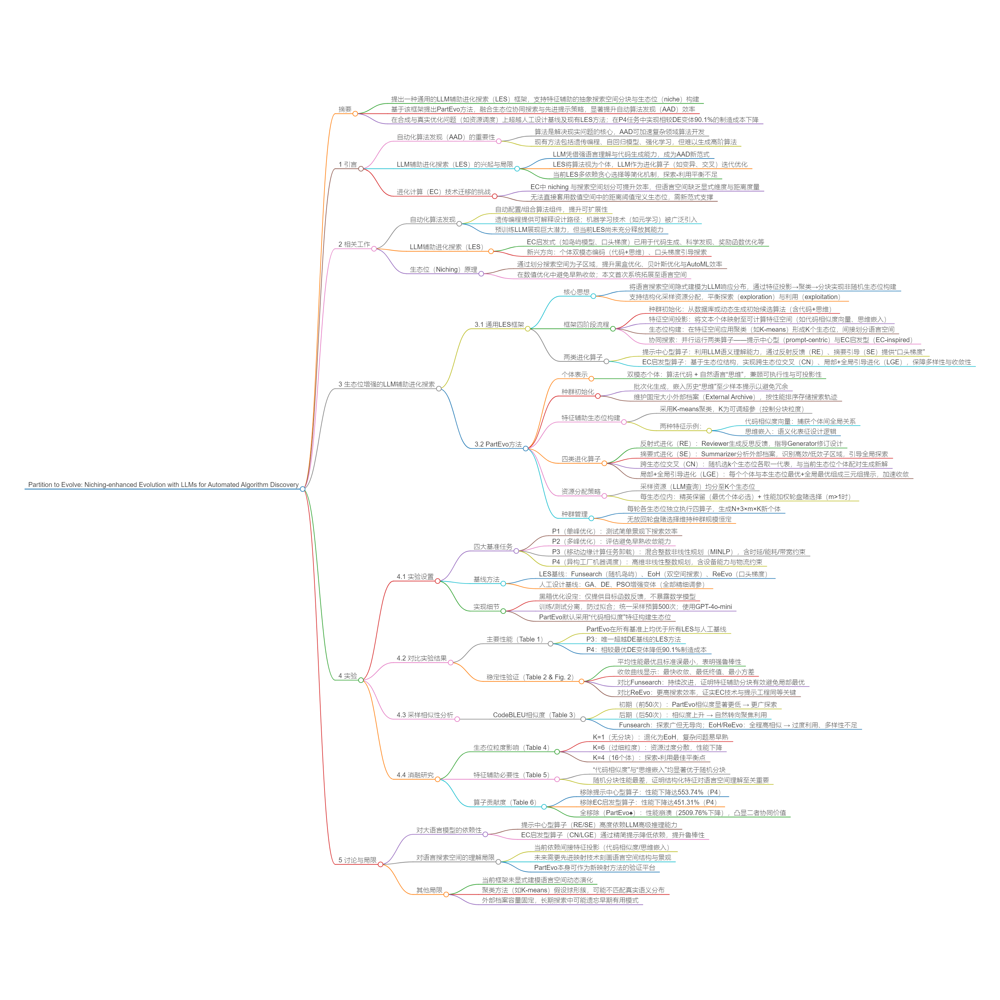

## Why it matters

Existing LES methods mostly rely on simple greedy selection or random grouping, failing to properly balance exploration and exploitation in unstructured language spaces, which severely limits search efficiency. PartEvo proves that mature evolutionary computation techniques can be systematically adapted to language spaces via feature projection, bringing substantial efficiency and robustness gains for algorithm discovery, especially under limited sampling budgets.

*Paper cover and opening figure. Source: Hu et al., PartEvo; see the [NeurIPS paper](https://openreview.net/pdf?id=OEawM2coNT).*

## Core method

The work presents a general niching-enhanced LES framework, which projects algorithm individuals into interpretable feature spaces and constructs niches via clustering to indirectly partition the abstract language search space. Built on this framework, PartEvo integrates four evolutionary operators and pairs with a niche-level resource allocation strategy to balance exploration and exploitation.

Experiments are conducted on both synthetic and real-world optimization benchmarks, with full comparisons against human-designed baselines and state-of-the-art LES methods.

## Contributions

- A general LES framework that enables structured niche construction in abstract language search spaces.
- It combines language gradients and niche collaborative search for higher discovery efficiency.
- State-of-the-art performance across multiple benchmarks, with up to 90.1% improvement on real-world scheduling tasks.

## Strengths and limitations

It systematically introduces niche-based EC techniques into LES for the first time, delivering healthy search dynamics and prominent efficiency gains on complex problems, with a flexible framework compatible with various features and clustering methods. However, it depends on low-cost algorithm evaluation and is less applicable to extremely expensive optimization scenarios, and the precision of language space feature mapping still has room for improvement.

## What to improve

Future work can explore finer-grained language space mapping approaches, adopt surrogate models to reduce evaluation overhead for expensive tasks, and design adaptive niche granularity mechanisms to reduce hyperparameter sensitivity.

## Connections

PartEvo is built directly on the thought-code dual representation from EoH as a structured upgrade to the single-population LES paradigm. Its feature-based niche construction systematically improves the random island model in Funsearch, while fully inheriting and extending the language gradient mechanism proposed in ReEvo.
