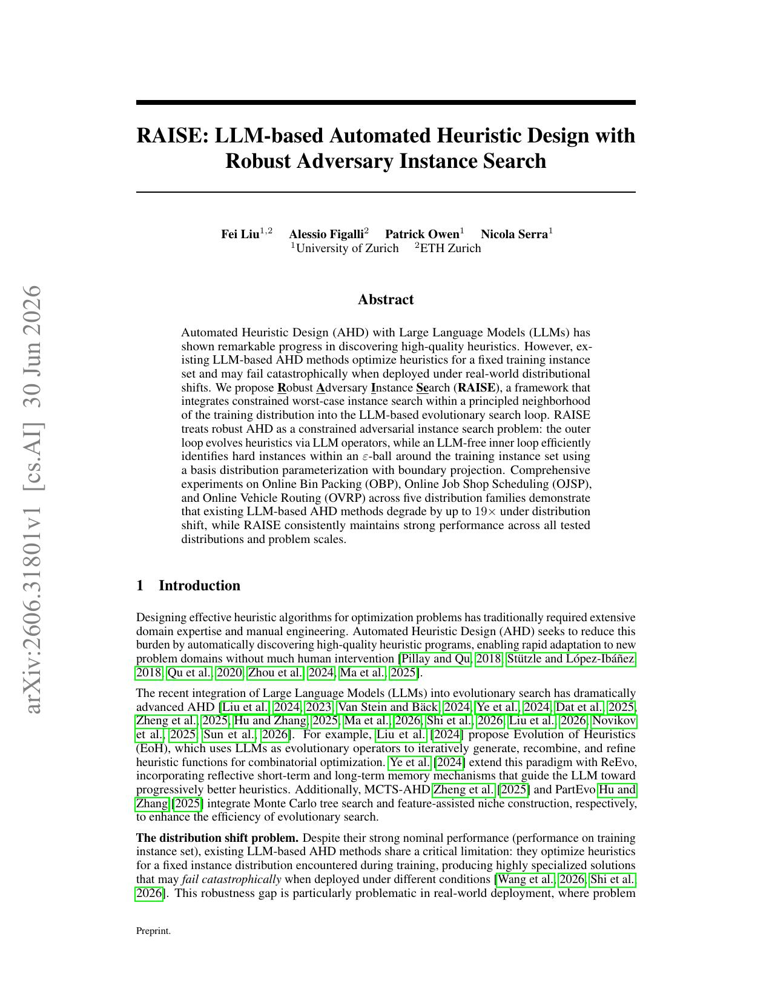

## Why it matters

LLM-based AHD often overfits a fixed training instance set and can degrade sharply under distributional shift. Portfolio methods such as heuristic sets still depend on predefined training distributions, while unconstrained adversarial instance generation can be costly and hard to control.

*Paper cover and opening figure. Source: Liu et al., RAISE; see the [arXiv paper](https://arxiv.org/abs/2606.31801).*

## Core method

RAISE formulates robust AHD as a constrained minimax problem: maximize heuristic quality while minimizing performance over instances in an epsilon-ball around the nominal training set. The outer loop uses LLM evolutionary operators to propose and refine heuristics. The inner loop is LLM-free: it searches for hard instances via a basis-distribution parameterization with boundary projection onto the uncertainty set.

The paper evaluates online bin packing, online job shop scheduling, and online vehicle routing across five distribution families and 95 datasets, comparing RAISE with existing LLM-AHD baselines under both nominal and shifted test conditions.

## Contributions

- An instance-level robust AHD objective as a constrained minimax problem over an epsilon-ball uncertainty set.
- RAISE, a bi-level framework combining LLM heuristic evolution with efficient adversarial instance search.
- Empirical evidence that RAISE maintains strong performance under shift while prior LLM-AHD methods can degrade by up to 19x.

## Strengths and limitations

The inner loop adds robustness pressure without extra LLM queries and gives a principled alternative to manually curating diverse training distributions. Performance still depends on the chosen robustness radius, basis parameterization, and the fidelity of the adversarial search within the uncertainty set.

## What to improve

Adaptive epsilon selection, richer basis families, and open releases of the adversarial search code would make cross-problem robustness claims easier to audit and extend.

## Connections

RAISE targets the same distributional robustness gap addressed by complementary portfolio approaches, but changes the training signal by actively searching for worst-case instances near the nominal distribution rather than relying on a fixed diverse training pool. The atlas records this as a contrast with EoH-S along the scope dimension.
