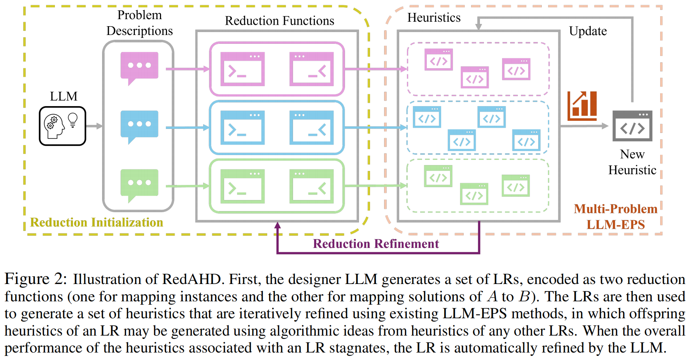
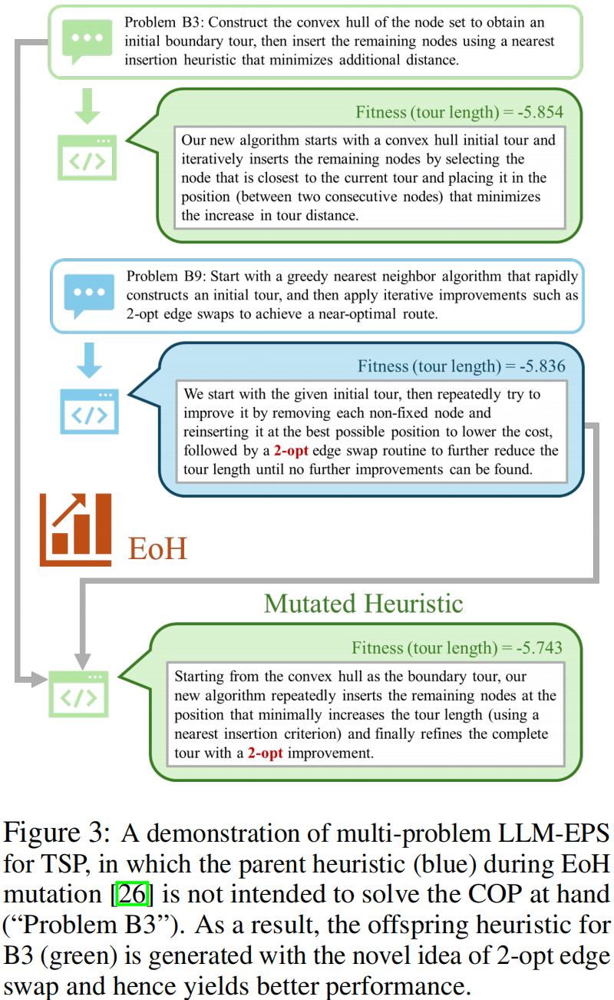

## Why it matters

Existing LLM-based evolutionary program search methods design strong heuristic components, but they still rely on a predetermined generalized algorithmic framework such as iterative construction, ant colony optimization, or guided local search. RedAHD targets this remaining manual step by using LLMs to automate language reduction, so the system can design heuristics for a target COP without requiring users to handcraft the framework around it.

## Core method

*Illustration of RedAHD. Source: Thach et al., RedAHD, Figure 2.*

RedAHD represents a language reduction as a problem description for a better-understood COP, a pair of LLM-generated reduction functions that map instances and solutions between the original problem and the transformed problem, and a code template used by the LLM-EPS method. The framework first initializes several candidate reductions, evaluates the heuristics associated with them, and keeps the reductions whose top heuristics perform best on the original COP.

Evolution then proceeds through multi-problem LLM-EPS. Heuristics associated with different reductions share algorithmic ideas during mutation or crossover, so a heuristic for one transformed COP can guide offspring for another. When the heuristics tied to a reduction stagnate, the LLM refines the reduction functions and code template, and the update is kept only if the reduction score improves.

*Multi-problem LLM-EPS example for TSP. Source: Thach et al., RedAHD, Figure 3.*

## Contributions

- An end-to-end AHD framework that lets existing LLM-EPS methods operate without manually specified GAFs.
- A language reduction mechanism in which the LLM generates reduction functions for mapping instances and solutions between COPs.
- A reduction refinement step that updates reductions when their associated heuristics stagnate.
- Experiments on six COPs showing competitive or improved performance with minimal human involvement.

## Strengths and limitations

The main strength is that RedAHD removes much of the manual GAF design still required by prior LLM-EPS work and explores a larger heuristic space through multiple reductions. Its reduction initialization greedily selects the top-scoring LRs, which may discard more promising reductions, and the generated LRs are not required to preserve approximation-ratio guarantees.

## What to improve

Useful next steps include more sophisticated LR selection methods such as Monte Carlo tree search, more advanced refinement procedures to escape local optima, and generated LRs that preserve approximation-ratio guarantees.

## Connections

RedAHD builds directly on existing LLM-EPS methods such as EoH, ReEvo, and MEoH. Its main distinction is that those methods are applied through LLM-generated language reductions, allowing the same evolutionary heuristic search machinery to operate without a manually specified GAF.
