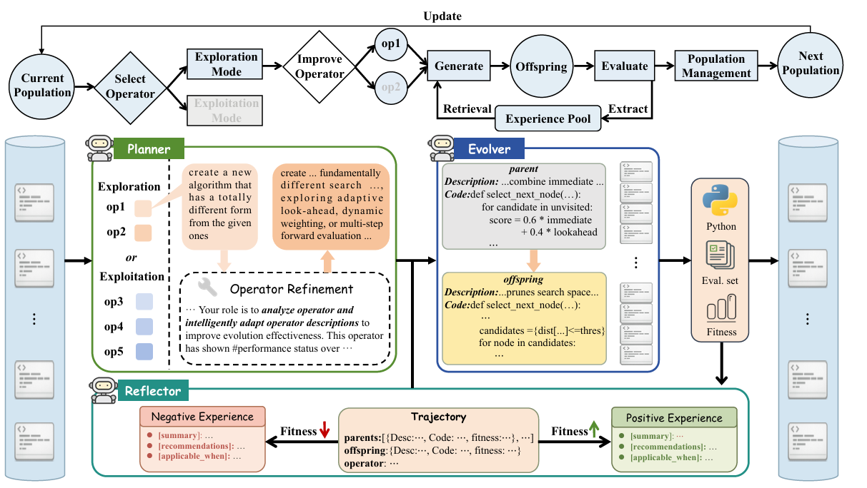

## Why it matters

LLM-based automatic heuristic design typically applies a fixed pool of prompt-implemented evolutionary operators to every generation, ignoring that operator usefulness depends on the current search state. Existing experience-accumulation mechanisms such as ReEvo and HSEvo summarize insights by contrasting final candidates, which treats each algorithm as an isolated data point: the relative improvement of an offspring over its parent is lost, lessons from failures are discarded, and generalized advice is applied in incompatible situations. RefineEvo addresses both gaps by making operator scheduling adaptive and experience trajectory-aware and bidirectional.

## Core method

Each heuristic is a thought-code pair of a natural-language description and executable code, evolved with an elitist population protocol. Three agents close the loop:

- **Planner.** Perceives population statistics (fitness stagnation, diversity) and per-operator utility (validity rate, success rate) to switch between Exploration and Exploitation modes, selects operators accordingly from a library initialized with EoH-style exploration and exploitation prompts, and triggers a Refinement Event that rewrites an operator's prompt when it persistently fails.
- **Reflector.** Analyzes parent-to-offspring trajectories after evaluation, recording positive insights for significant gains and negative pitfalls for notable degradations, each bound to an applicable condition so advice stays situation-specific.
- **Evolver.** Retrieves the most relevant positive and negative experiences by semantic similarity and injects them into the generation prompt as insights to follow and pitfalls to avoid; a utility-tracking maintenance policy prunes stale records.

Candidates are evaluated in Python on problem instance sets, with fitness defined as the negative cost. Experiments use DeepSeek-v3 as the backbone (gpt-4o-mini and gpt-4o for robustness) and evolve constructive heuristics, the heuristic-information term of Ant Colony Optimization, and the edge-utility update rule of Guided Local Search.

## Contributions

- A Planner performing state-aware operator selection and dynamic operator refinement when progress stalls, replacing indiscriminate use of a fixed operator pool.
- A Bidirectional Experience Pool storing trajectory-aware, situation-conditioned positive and negative lessons with retrieval-augmented generation and utility-based pruning.
- State-of-the-art results across TSP, KP, online BPP, CVRP, and VRPTW benchmarks, including the best TSPLIB generalization gap (11.54%) and improved token efficiency over strong LLM-based AHD baselines.

## Strengths and limitations

The framework demonstrably outperforms FunSearch, EoH, ReEvo, LLM-LNS, HSEvo, MCTS-AHD, PartEvo, and OpenEvolve on most scales, with ablations confirming that planning, refinement, and bidirectional experience each contribute. Limitations include reliance on the quality of LLM-written prompts and reflected lessons, embedding-based retrieval that may miss relevant experience, and evaluation centered on constructive heuristics and two metaheuristic components rather than complete solver programs.

## What to improve

Ground reflected lessons in verifiable behavioral evidence rather than LLM judgment alone, study experience transfer across problems, and extend the planner to jointly manage evaluation budgets and population size.

## Connections

RefineEvo extends the EoH line by making its fixed operator library adaptive through planning-guided scheduling and prompt refinement. Its Bidirectional Experience Pool strengthens the reflective-feedback mechanism introduced by ReEvo with trajectory awareness and explicit failure lessons. It is contemporaneous with prompt-heuristic co-evolution work while operating at the finer granularity of individual operators.
