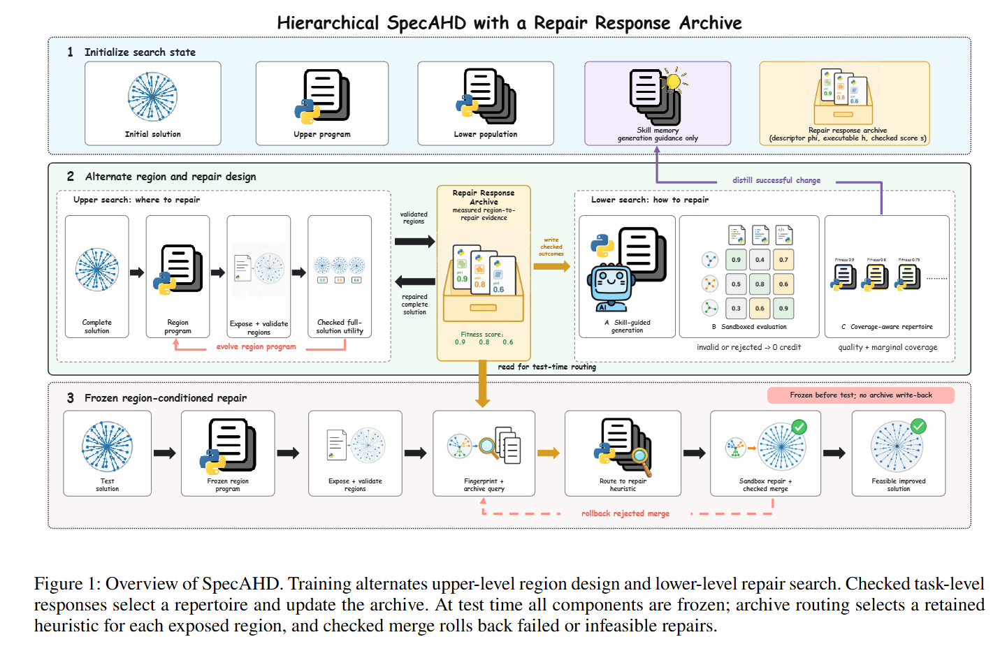

## Why it matters

Most AHD systems design one heuristic that has to perform well across every region of every instance. In large-scale routing, the cost landscape is heterogeneous: short, dense city tours share little structure with long, capacity-tight depot tours. A single globally optimized heuristic tends to be dragged toward the average behavior and underperforms on every region. SpecAHD moves specialization inside the search, so the framework can decide both which regions deserve dedicated repair and which heuristics should serve them.

## Core method

SpecAHD couples two search levels:

- An **upper-level program** reads the incumbent solution, diagnoses where it is locally weak, and proposes bounded repair regions.
- A **lower-level repertoire search** evolves a complementary set of executable construction heuristics, each conditioned on a region type rather than the whole instance.

An exact checker merges repairs, rolls back infeasible changes, and stores the outcomes in a repair response archive of region descriptors, heuristic identifiers, and checked improvements. At inference time, weighted nearest-neighbor routing picks a specialized heuristic for each exposed region. For a fixed region set and candidate pool, the repertoire objective is monotone submodular, so greedy selection admits a \(1 - 1/e\) approximation guarantee. Experiments across CVRP, TSP, VRPTW, and SDVRP, and across multiple LLM backbones, report substantial held-out cost reductions.

## Contributions

- A bilevel design object that specializes heuristics to local regions rather than whole instances.
- A repair response archive connecting region descriptors, heuristic identities, and checked outcomes.
- A monotone submodular selection guarantee for the repertoire, with a greedy approximation.
- Strong held-out improvements across four routing problems and several LLM backbones.

## Strengths and limitations

SpecAHD turns specialization from a hand-designed rule into a learned bilevel decision and gives a concrete theoretical handle on repertoire quality. Its performance depends on having meaningful local region descriptors, on the quality of the upper-level region proposer, and on the feasibility checker's ability to roll back all changes. The bilevel split also enlarges the search surface and adds a coordination cost between the two searches.

## What to improve

Better learned region descriptors, stronger upper-level region proposers, and tighter integration with continuous- or feature-level tuning inside each region.

## Connections

SpecAHD broadens EoH-style heuristic evolution from whole-instance scoring to within-instance specialization. It is complementary to instance-set approaches such as EoH-S that produce complementary heuristics across instances, and to bilevel algorithm-design systems such as BEAM and A2DEPT that operate on whole solver structures.